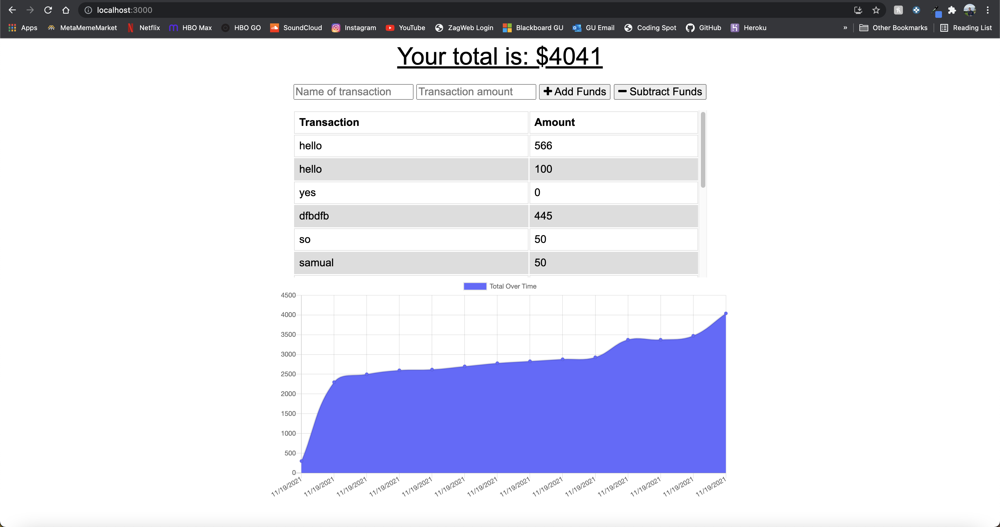

# budget-tracker

## About

### Budget Tracker allows the user to input expenditures, both online and offline, and keep track of their expenses. Users can also deduce expenses, so that their budget accurately reflects their overall owed/earned amount. 

* Budget Tracker allows the user to install the application to their device, so that usage can be utilized even when offline mode is detected. The app will track and display all usages, even when expenses are added in an offline state. 

## Screenshots 

## Creator 

* Ryan Allen's GitHub: https://github.com/Rallen4/budget-tracker
* Live Site: https://budget-by-ryan.herokuapp.com/